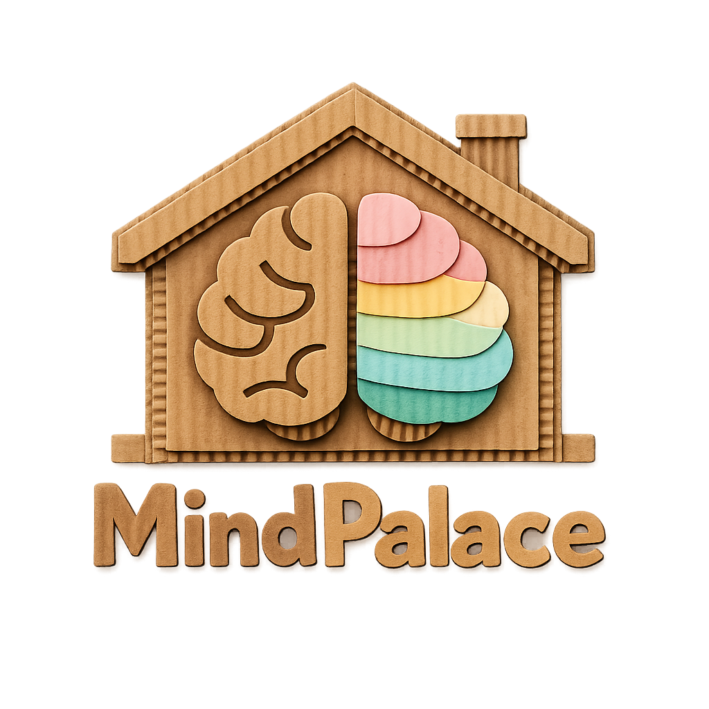

**Your Family's Digital Memory Palace**

> *"I consider that a man's brain originally is like a little empty attic, and you have to stock it with such furniture as you choose."*  
> — Sherlock Holmes, *A Study in Scarlet*

MindPalace is a touchscreen-first family organization hub that transforms your home display into a centralized command center. Inspired by the ancient Greek **Method of Loci** (memory palace technique) used by Sherlock Holmes, MindPalace helps you visually organize and access everything important to your household—all in one beautiful, intuitive interface.

## 🎯 What is MindPalace?

MindPalace is a self-hosted web application designed specifically for touch-enabled displays (tablets, smart displays, Raspberry Pi setups, etc.). It's your family's digital "memory palace"—a single place where you can:

- 📅 **Track schedules** with multi-calendar support
- ✅ **Manage tasks** and chores with reward systems
- 🍽️ **Plan meals** and generate shopping lists
- 📝 **Take notes** and set reminders
- ⏰ **Set alarms** for the whole household
- 📸 **Display family photos** from your Immich server
- 🌤️ **Monitor weather** with detailed forecasts
- 🎁 **Track rewards** and motivate family members
- 📋 **Organize groceries** and meal suggestions
- 🏠 **Display house rules** for everyone to see

Everything is organized visually, making it easy to see what's happening in your household at a glance.

---

## 🚀 Quick Start (For Everyone)

### What You'll Need

- A computer or server to run MindPalace (Raspberry Pi, old laptop, Proxmox VM, etc.)
- Node.js installed (version 16 or higher)
- An internet connection
- (Optional) A CalDAV calendar server for scheduling
- (Optional) An Immich instance for photo display
- (Optional) An OpenWeatherMap API key for weather

### Installation Steps

1. **Download MindPalace**
   ```bash
   git clone https://github.com/YOUR_USERNAME/MindPalace.git
   cd MindPalace
   ```

2. **Install the Backend**
   ```bash
   cd server
   npm install
   ```

3. **Install the Frontend**
   ```bash
   cd ../client
   npm install
   ```

4. **Configure Environment**
   
   Create `server/.env`:
   ```env
   PORT=5000
   ADMIN_PIN=1234
   ```
   
   Create `client/.env`:
   ```env
   VITE_REACT_APP_API_URL=http://localhost:5000
   VITE_OPENWEATHER_API_KEY=your_key_here
   ```

5. **Start the Application**
   
   In one terminal:
   ```bash
   cd server
   npm start
   ```
   
   In another terminal:
   ```bash
   cd client
   npm run dev
   ```

6. **Open in Your Browser**
   
   Navigate to `http://localhost:3000` (or the port shown in the terminal)

That's it! You're ready to start organizing your household. 🎉

---

## 📖 User Guide (For Families)

### First Time Setup

When you first open MindPalace, click the **⚙️ Settings** icon (gear) in the top-right corner to access the Admin Panel.

#### Step 1: Add Family Members
1. Go to **Users** tab
2. Click **Add User**
3. Enter name and upload a photo (optional)
4. Set initial reward balance if using the reward system

#### Step 2: Set Up Your Calendar (Optional but Recommended)
1. Go to **Calendars** tab
2. Click **Add Calendar**
3. Enter your CalDAV server details:
   - Display name (e.g., "Family Calendar")
   - Server URL (e.g., `https://caldav.example.com/calendar/`)
   - Username and password
   - Choose a color for events
4. Click **Test Connection** to verify
5. **Set as Default** - This calendar will be used for todos and notes

#### Step 3: Enable Widgets
1. Go to **Widgets** tab
2. Toggle on the widgets you want to use:
   - **Chores** - Track family tasks and rewards
   - **Calendar** - View and manage events
   - **Photos** - Display family memories
   - **Weather** - Current conditions and forecast
   - **Todos** - Daily task management
   - **Notes** - Quick notes and reminders
   - **Alarms** - Household alarms
   - **House Rules** - Display family rules
   - **Marbles** - Track reward points
   - **Grocery List** - Shopping management
   - **Meal Planner** - Weekly meal planning
   - **Meal Suggestions** - Family meal ideas

#### Step 4: Customize Your Theme
1. Go to **Interface** tab
2. Choose a preset or customize:
   - Colors (primary, secondary, accent)
   - Typography (fonts, sizes)
   - Spacing and borders
   - Calendar event styling

### Daily Use

#### Adding Chores
1. Open the **Chores Widget**
2. Click **Add Chore**
3. Select a family member
4. Enter chore details and reward amount
5. Click **Save**

#### Planning Meals
1. Open the **Meal Planner Widget**
2. Click **Add Meal**
3. Enter meal details, ingredients, and timing
4. Meals can be one-time (specific date) or recurring (every Monday, etc.)

#### Managing Groceries
1. Open the **Grocery List Widget**
2. Click **Add Item** to manually add items
3. Or use **Generate from Meals** (admin only) to auto-create from your meal plan
4. Check off items as you shop

#### Setting Alarms
1. Open the **Alarm Widget**
2. Click **Add Alarm**
3. Set time, title, and repeat schedule
4. Choose alert types (sound, notification, visual)

### Tips for Best Experience

- **Use the default calendar** for todos and notes - it's faster and more reliable
- **Enable screen refresh** to prevent burn-in on always-on displays
- **Customize widget transparency** to match your display setup
- **Set up multiple photo sources** if you have multiple Immich albums
- **Use the prize spinner** in Chores Widget to make completing tasks fun for kids

---

## 🛠️ Technical Documentation

### System Requirements

- **Node.js**: v16 or higher
- **npm**: Comes with Node.js
- **Operating System**: Linux recommended (works on Windows/Mac for development)
- **Memory**: 512MB minimum, 1GB+ recommended
- **Storage**: 100MB+ for application, additional space for database and uploads

### Architecture

MindPalace consists of two main components:

- **Backend** (`server/`): Fastify-based API server with SQLite database
- **Frontend** (`client/`): React + Vite application with Material-UI components

### Database Schema

MindPalace uses SQLite with the following main tables:

- `users` - Family member profiles and reward totals
- `chores` - Task assignments and completion status
- `calendar_sources` - CalDAV calendar configurations
- `settings` - Application configuration and API keys
- `prizes` - Reward system items
- `alarms` - Global household alarms
- `house_rules` - Family rules with Markdown support
- `marbles` - Reward tracking per user
- `marble_history` - Audit trail of marble changes
- `meals` - Meal planning entries with rich metadata
- `grocery_items` - Shopping list items
- `meal_suggestions` - User-submitted meal ideas
- `photo_sources` - Immich photo source configurations

### API Endpoints

#### Calendar & Events
- `GET /api/calendar-events` - Fetch events from all enabled calendars
- `POST /api/caldav/events` - Create new event
- `PUT /api/caldav/events/:uid` - Update event
- `DELETE /api/caldav/events/:uid` - Delete event

#### Todos
- `GET /api/caldav/todos` - Fetch todos from default calendar
- `POST /api/caldav/todos` - Create new todo
- `PUT /api/caldav/todos/:uid` - Update todo
- `DELETE /api/caldav/todos/:uid` - Delete todo

#### Notes
- `GET /api/caldav/notes` - Fetch notes from default calendar
- `POST /api/caldav/notes` - Create new note
- `PUT /api/caldav/notes/:uid` - Update note
- `DELETE /api/caldav/notes/:uid` - Delete note

#### Meals
- `GET /api/meals` - Get all meals (with optional filtering)
- `GET /api/meals/week/:startDate` - Get meals for a specific week
- `POST /api/meals` - Create meal (admin PIN required)
- `PUT /api/meals/:id` - Update meal (admin PIN required)
- `DELETE /api/meals/:id` - Delete meal (admin PIN required)

#### Grocery List
- `GET /api/grocery` - Get all grocery items
- `POST /api/grocery` - Add grocery item
- `PUT /api/grocery/:id` - Update grocery item
- `POST /api/grocery/:id/check` - Check/uncheck item
- `DELETE /api/grocery/:id` - Delete grocery item
- `POST /api/grocery/generate-from-meals` - Auto-generate from meals (admin PIN required)

#### Alarms
- `GET /api/alarms` - Get all alarms
- `POST /api/alarms` - Create alarm
- `PUT /api/alarms/:id` - Update alarm
- `DELETE /api/alarms/:id` - Delete alarm

#### Users & Chores
- `GET /api/users` - Get all users
- `POST /api/users` - Create user
- `PUT /api/users/:id` - Update user
- `GET /api/chores` - Get all chores
- `POST /api/chores` - Create chore
- `PUT /api/chores/:id` - Update chore
- `DELETE /api/chores/:id` - Delete chore

### CalDAV Integration

MindPalace uses **CalDAV REPORT requests** for efficient calendar queries. This provides:

- Better performance with large calendars
- Support for filtering and date ranges
- Proper handling of recurring events
- Full CRUD operations (Create, Read, Update, Delete)

**Supported CalDAV Servers:**
- Nextcloud
- Radicale
- Baikal
- SabreDAV/Davis
- Any CalDAV-compliant server

### Environment Variables

#### Backend (`server/.env`)
```env
PORT=5000                    # Backend server port
ADMIN_PIN=1234              # PIN for admin actions (change this!)
ENCRYPTION_KEY=your-key     # For encrypting calendar passwords (32+ bytes)
```

#### Frontend (`client/.env`)
```env
VITE_REACT_APP_API_URL=http://localhost:5000
VITE_OPENWEATHER_API_KEY=your_openweather_api_key
```

### Port Configuration

**Default Ports:**
- Backend: `5000`
- Frontend: `3000` (Vite will auto-increment if in use)

**Custom Ports:**

Backend - Set in `server/.env`:
```env
PORT=8080
```

Frontend - Set in `client/vite.config.js`:
```javascript
export default {
  server: {
    port: 3001
  }
}
```

Don't forget to update `client/.env` if you change the backend port!

### Security

#### Admin PIN Protection

Sensitive actions require an admin PIN:
- Adding/editing/deleting meals
- Managing house rules
- Removing/overriding marbles
- Clearing checked grocery items
- Generating grocery lists
- Converting meal suggestions
- Managing calendar sources
- Updating API settings

The PIN is stored in browser localStorage after verification (session-based).

**Change the default PIN** in `server/.env`:
```env
ADMIN_PIN=your_secure_pin_here
```

#### Data Encryption

Calendar passwords are encrypted using AES-256-CBC before storage. Set a strong `ENCRYPTION_KEY` in production.

### Backup & Restore

#### Backup Your Data

```bash
# Backup database (contains all app data)
cp server/data/tasks.db /path/to/backup/

# Backup uploaded photos
cp -r server/uploads /path/to/backup/

# Backup custom widgets
cp -r server/widgets /path/to/backup/

# Backup photo cache (optional)
cp -r server/cache /path/to/backup/
```

#### Restore from Backup

```bash
# Restore database
cp /path/to/backup/tasks.db server/data/

# Restore uploads
cp -r /path/to/backup/uploads server/

# Restore widgets
cp -r /path/to/backup/widgets server/
```

### Reverse Proxy Setup (Optional)

For HTTPS and custom domains using Nginx:

```nginx
server {
    listen 80;
    server_name your-domain.com;
    
    location / {
        proxy_pass http://localhost:3000;
        proxy_set_header Host $host;
        proxy_set_header X-Real-IP $remote_addr;
        proxy_set_header X-Forwarded-For $proxy_add_x_forwarded_for;
        proxy_set_header X-Forwarded-Proto $scheme;
    }
    
    location /api {
        proxy_pass http://localhost:5000;
        proxy_set_header Host $host;
        proxy_set_header X-Real-IP $remote_addr;
        proxy_set_header X-Forwarded-For $proxy_add_x_forwarded_for;
        proxy_set_header X-Forwarded-Proto $scheme;
    }
}
```

### Troubleshooting

#### Widgets Not Loading
- Check Admin Panel → Widgets tab to ensure widgets are enabled
- Check browser console for JavaScript errors
- Verify API connectivity (check backend server logs)
- Ensure widgets handle both light/dark themes properly

#### Calendar Not Showing Events
- Verify calendars are enabled in Admin Panel → Calendars
- Use "Test Connection" button to verify CalDAV server accessibility
- Check backend logs for CalDAV connection errors
- Ensure your CalDAV server supports REPORT requests
- Verify credentials are correct

#### Weather Widget Not Working
- Confirm OpenWeatherMap API key is valid in Admin Panel → APIs
- Check API key hasn't exceeded rate limits (free tier: 60 calls/minute)
- Verify zip code format in Admin Panel → Interface → Weather
- Check browser console for API error messages

#### Server Not Starting
```bash
# Check if port is already in use
# Linux/Mac:
lsof -i :5000  # Backend
lsof -i :3000  # Frontend

# Windows:
netstat -ano | findstr :5000
netstat -ano | findstr :3000

# Check server logs in terminal
```

#### Permission Issues
```bash
# Ensure write permissions for data directory
chmod -R 755 server/data

# If using uploads directory
chmod -R 755 server/uploads
```

---

## 🎨 Features Overview

### Core Widgets

#### 📅 Calendar Widget
- **5 View Modes**: Yearly, Monthly, Weekly, 3 Day, and Daily views
- **Multi-Source Support**: Connect multiple CalDAV calendars
- **Event Management**: Create, edit, and delete events directly
- **Color-Coded**: Each calendar source has its own color
- **Calendar Legend**: See all enabled calendars at a glance
- **Interactive**: Click events for details, click empty slots to add events

#### ✅ Chores Widget
- **Three-Section Layout**: User Chores, Bonus Chores, and Prizes
- **Reward System**: Earn customizable currency (default: "shells") for completing chores
- **Prize Spinner**: Interactive wheel for selecting prizes
- **User Profiles**: Display user photos with letter fallback
- **Progress Tracking**: Visual indicators for completion

#### 🍽️ Meal Planning Suite
- **Meal Planner**: Weekly meal planning with rich metadata (ingredients, timing, categories)
- **Grocery List**: Shopping list with meal integration and user assignment
- **Meal Suggestions**: Family members can submit meal ideas

#### 📝 Todos Widget
- **Day-by-Day View**: Navigate between days easily
- **Click-to-Complete**: Simple tap to mark done
- **Undo Functionality**: 5-second undo window
- **User Assignment**: Optional assignment to family members

#### 📄 Notes Widget
- **CalDAV Integration**: Notes stored in your default calendar
- **Expandable View**: Collapse/expand for quick scanning
- **Chronological**: Most recently modified first

#### ⏰ Alarm Widget
- **Global Alarms**: Household-wide alarm system
- **Flexible Scheduling**: One-time or recurring (daily, weekly, custom days)
- **Multiple Alerts**: Sound, browser notifications, and visual alerts

#### 🏠 House Rules Widget
- **Markdown Support**: Rich text formatting for rules
- **Always Visible**: Keep important rules on display
- **Admin-Managed**: Centralized control through Admin Panel

#### 🎯 Marble Chart Widget
- **Reward Tracking**: Track marbles earned by family members
- **Visual Charts**: Interactive charts and graphs
- **History Log**: Complete audit trail of changes
- **Daily Increment**: Automatic daily awards (configurable)

#### 📸 Photo Widget
- **Immich Integration**: Display photos from self-hosted Immich
- **Multiple Sources**: Configure multiple photo sources
- **Slideshow Mode**: Automatic slideshow with configurable intervals
- **Manual Navigation**: Next/previous controls in header

#### 🌤️ Weather Widget
- **Current Conditions**: Real-time weather data
- **3-Day Forecast**: Extended forecast with detailed information
- **Interactive Charts**: Temperature and precipitation graphs
- **Air Quality**: Display AQI when available
- **Responsive Layouts**: Adapts to widget size (compact/medium/full)

### Advanced Features

#### Burn-in Prevention
- **Configurable Screen Refresh**: Automatic page refreshes (1-12 hours)
- **Random Geometric Backgrounds**: Dynamic pattern generation
- **Dynamic Card Shuffle**: Randomize widget positions

#### Theming System
- **Light/Dark Modes**: Seamless theme switching
- **Custom Colors**: Personalize primary, secondary, and accent colors
- **Typography Control**: Adjust fonts, sizes, line heights
- **Spacing System**: Fine-tune spacing scale
- **Border Radius**: Customize corner rounding
- **Elevation System**: Adjust shadow depth

#### Custom Widgets
- Upload your own HTML widgets
- Full theme integration (light/dark modes)
- Transparency support
- Sandboxed iframe execution
- Local storage per widget

---

## 🤝 Contributing

We welcome contributions! Here's how to get started:

1. **Fork the Repository**
2. **Create a Feature Branch**: `git checkout -b feature/amazing-feature`
3. **Make Your Changes**: Follow existing code style
4. **Test Thoroughly**: Ensure both light/dark themes work
5. **Submit a Pull Request**: Describe your changes clearly

### Development Guidelines

- **Follow existing patterns** for consistency
- **Test on multiple screen sizes** (mobile, tablet, desktop)
- **Verify theme compatibility** (light/dark modes)
- **Update documentation** for new features
- **Add error handling** for robust operation

---

## 📄 License

This project is available under the [Normally Open Public License](LICENSE). Everything not prohibited is permitted.

**Prohibited Purposes:**
- Commercial use, including selling services based on this software
- Commercial distribution, including reselling this software

For all other uses, you are free to use, modify, and distribute this software. See the [LICENSE](LICENSE) file for full terms.

---

## 🙏 Acknowledgments

- **Method of Loci**: Ancient Greek memory technique that inspired the name
- **Sherlock Holmes**: Literary inspiration for the "memory palace" concept
- **Material-UI**: Component library and theming
- **Fastify**: High-performance backend framework
- **React**: Frontend framework
- **CalDAV Community**: For calendar protocol standards

---

## 💬 Getting Help

- **GitHub Issues**: Report bugs and request features
- **Documentation**: Check this README and inline code comments
- **Logs**: Check terminal output from both backend and frontend servers

---

**MindPalace** - Transform your household into an organized, efficient, and connected family hub. Build your digital memory palace today! 🧠✨
