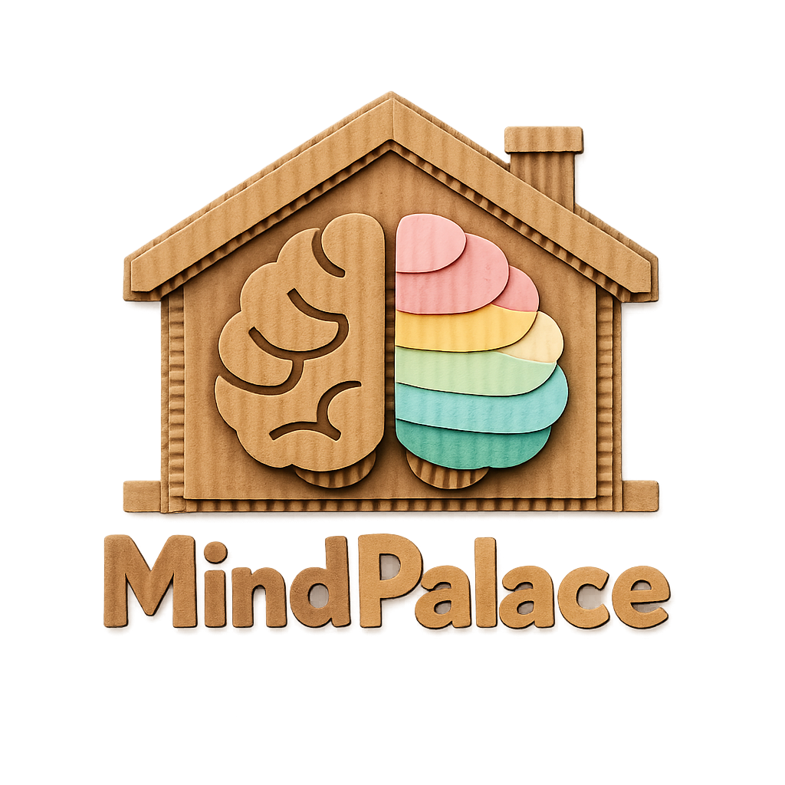

**Your Family's Digital Memory Palace**

> *"I consider that a man's brain originally is like a little empty attic, and you have to stock it with such furniture as you choose."*  
> — Sherlock Holmes, *A Study in Scarlet*

MindPalace is a touchscreen-first family organization hub that transforms your home display into a centralized command center. Inspired by the ancient Greek **Method of Loci** (memory palace technique) used by Sherlock Holmes, MindPalace helps you visually organize and access everything important to your household—all in one beautiful, intuitive interface.

## 🎯 What is MindPalace?

MindPalace is a self-hosted web application designed specifically for touch-enabled displays (tablets, smart displays, Raspberry Pi setups, etc.). It's your family's digital "memory palace"—a single place where you can:

- 📅 **Track schedules** with multi-calendar support
- ✅ **Manage tasks** and chores with reward systems
- 🍽️ **Plan meals** and generate shopping lists
- 📝 **Take notes** and set reminders
- ⏰ **Set alarms** for the whole household
- 📸 **Display family photos** from your Immich server
- 🌤️ **Monitor weather** with detailed forecasts
- 🎁 **Track rewards** and motivate family members
- 📋 **Organize groceries** and meal suggestions
- 🏠 **Display house rules** for everyone to see

Everything is organized visually, making it easy to see what's happening in your household at a glance.

---

## 📄 License

This project is available under the [Normally Open Public License](LICENSE). Everything not prohibited is permitted.

**Prohibited Purposes:**
- Commercial use, including selling services based on this software
- Commercial distribution, including reselling this software

For all other uses, you are free to use, modify, and distribute this software. See the [LICENSE](LICENSE) file for full terms.

---

## 🙏 Acknowledgments

- **Method of Loci**: Ancient Greek memory technique that inspired the name
- **Sherlock Holmes**: Literary inspiration for the "memory palace" concept
- **Material-UI**: Component library and theming
- **Fastify**: High-performance backend framework
- **React**: Frontend framework
- **CalDAV Community**: For calendar protocol standards

---

## ⚙️ Configuration

### Environment Variables

#### Designer Server (`designer/server`)

- **`GOOGLE_FONTS_API_KEY`** (optional): Google Fonts Developer API key for accessing all Google Fonts in the Designer
  - Get your free API key from [Google Cloud Console](https://console.cloud.google.com/apis/credentials)
  - Enable the "Web Fonts Developer API" in API restrictions
  - Without this key, the Designer will use a limited static font list
  - Set in your environment or `.env` file: `GOOGLE_FONTS_API_KEY=your_api_key_here`

#### Main Server (`server`)

- **`PORT`**: Server port (default: 5000)
- **`HOST`**: Server host (default: localhost)
- **`ADMIN_PIN`**: Admin panel PIN (default: 1234)
- **`ENCRYPTION_KEY`**: Encryption key for sensitive data (change in production!)
- **`GOOGLE_FONTS_API_KEY`** (optional): Google Fonts Developer API key for the main app typography
  - Same key you use for the Designer can be reused here
  - Enable the \"Web Fonts Developer API\" in Google Cloud for this key
  - When set, `/api/themes/fonts` will return Google Fonts + any local fonts from `server/themes/fonts`

#### Client (`client`)

- **`VITE_REACT_APP_API_URL`**: Backend API URL (default: http://localhost:5000)
- **`VITE_HOST`**: Vite dev server host (default: true/all interfaces)

---

## 💬 Getting Help

- **GitHub Issues**: Report bugs and request features
- **Documentation**: Check this README and inline code comments
- **Logs**: Check terminal output from both backend and frontend servers

---

**MindPalace** - Transform your household into an organized, efficient, and connected family hub. Build your digital memory palace today! 🧠✨
